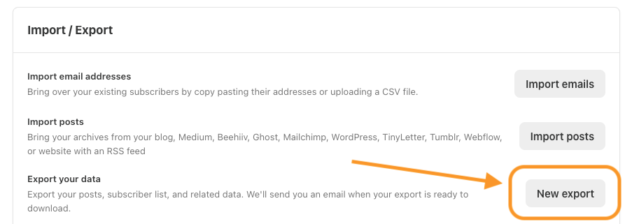
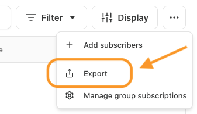

# Substack Subscriber Analytics

A powerful Streamlit dashboard for analyzing your Substack newsletter's subscriber engagement, growth metrics, and list health.

Based on Sharyph's excellent [newsletter audit playbook](https://newsletter.thedigitalcreator.co/p/substack-newsletter-audit-playbook).

## Features

- **7 Key Metrics Dashboard**: Track open rates, conversion rates, growth, and churn with industry benchmarks
- **Post Analysis**: See which posts drive the most engagement and conversions
- **Subscriber Segmentation**: Identify super engagers, at-risk subscribers, and geographic distribution
- **Engagement Flow**: Visualize how subscribers move through engagement states with Sankey diagrams
- **List Cleaning Tools**: Find inactive subscribers and optimize your list health
- **Drag-and-Drop Upload**: Easy data import with automatic validation

## Getting Started

### Step 1: Install Python (if you don't have it)

First, check if Python is already installed. Open your terminal and type:

```bash
python3 --version
```

If you see a version number (3.9 or higher), skip to Step 2. If not, install Python:

**Mac:**
1. Download Python from [python.org/downloads](https://www.python.org/downloads/)
2. Open the downloaded file and follow the installer

**Windows:**
1. Download Python from [python.org/downloads](https://www.python.org/downloads/)
2. **Important:** Check the box that says "Add Python to PATH" during installation
3. Follow the installer prompts

> **How to open a terminal:**
> - **Mac:** Press `Cmd + Space`, type "Terminal", press Enter
> - **Windows:** Press `Win + R`, type "cmd", press Enter

### Step 2: Download this project

**Option A: Download as ZIP (easiest)**
1. Click the green **Code** button at the top of this page
2. Click **Download ZIP**
3. Unzip the downloaded file
4. Open your terminal and navigate to the folder:
   ```bash
   cd ~/Downloads/substack-subscriber-analytics-main
   ```

**Option B: Using Git (if you have it)**
```bash
git clone https://github.com/yourusername/substack-subscriber-analytics.git
cd substack-subscriber-analytics
```

### Step 3: Set up a virtual environment

A virtual environment keeps this project's packages separate from your other Python projects. In your terminal (make sure you're in the project folder), run:

**Mac/Linux:**
```bash
python3 -m venv venv
source venv/bin/activate
```

**Windows:**
```bash
python -m venv venv
venv\Scripts\activate
```

You'll know it worked when you see `(venv)` at the start of your terminal line.

### Step 4: Install the required packages

With your virtual environment activated, run:

```bash
pip install -r requirements.txt
```

### Step 5: Run the app

**Using Make (recommended):**
```bash
make run
```

**Or manually:**
```bash
streamlit run app.py
```

Your browser should automatically open to the dashboard. If it doesn't, go to: **http://localhost:8501**

### Makefile Commands

| Command | Description |
|---------|-------------|
| `make run` | Start the Streamlit application (creates venv if needed) |
| `make install` | Create virtual environment and install dependencies |
| `make clean` | Remove the virtual environment |
| `make help` | Show available commands |
| `make info` | Show detected OS and configuration paths |

### Quick Reference (Using Make)

The easiest way to run the app is with Make, which handles the virtual environment automatically.

**Mac/Linux:**
```bash
cd /path/to/substack-subscriber-analytics
make run
```

**Windows (with Make installed):**
```bash
cd \path\to\substack-subscriber-analytics
make run
```

> **Note for Windows users:** Make is not installed by default. See [Installing Make on Windows](#installing-make-on-windows) below.

### Quick Reference (Manual)

If you prefer not to use Make, activate the virtual environment manually:

**Mac/Linux:**
```bash
cd /path/to/substack-subscriber-analytics
source venv/bin/activate
streamlit run app.py
```

**Windows:**
```bash
cd \path\to\substack-subscriber-analytics
venv\Scripts\activate
streamlit run app.py
```

## Getting Your Substack Data

### 1. Complete Data Export (Required)

Export your complete newsletter data from Substack:

1. Go to your Substack dashboard
2. Navigate to **Settings** → **Exports**
3. Click **"Download a zip of all your data"**



This zip file contains:
- `email_list.*.csv` - Your subscriber list
- `posts.csv` - All your posts
- `posts/` folder - Engagement data (opens and deliveries per post)

### 2. Subscriber Details Export (Optional but Recommended)

For richer analytics including geographic data and multi-channel engagement:

1. Go to your Substack dashboard
2. Navigate to **Subscribers**
3. Click **"Export"** to download `subscriber_details.csv`



This unlocks:
- Geographic segmentation (by country/region)
- Multi-channel engagement tracking (email, web, comments, shares)
- Advanced inactive subscriber analysis
- Engagement flow Sankey diagrams

## Usage

### First Run

1. When you first open the app, you'll see the upload modal
2. Drag and drop your Substack export `.zip` file
3. The app validates and extracts your data automatically
4. Optionally add `subscriber_details.csv` for enhanced analytics

### Dashboard Navigation

Use the sidebar to navigate between views:

- **Overview**: Key metrics at a glance with conversion funnel
- **Post Analysis**: Engagement rates and conversion attribution by post
- **Subscriber Analysis**: Acquisition trends and source analysis
- **Engagement Trends**: Monthly open rate trends and activity
- **Segments**: Super engagers, at-risk subscribers, geographic breakdown
- **Engagement Flow**: Sankey diagrams showing subscriber journeys
- **Inactive Subscribers**: List cleaning recommendations and impact analysis

### Data Management

- **Multiple Datasets**: Upload and switch between different data exports
- **Add Details**: Enhance any dataset by adding `subscriber_details.csv`
- **Delete**: Remove old datasets you no longer need

## Data Privacy

Your data stays on your machine:
- All processing happens locally
- Uploaded data is stored in `.data/` (gitignored)
- No data is sent to external servers

## Project Structure

```
substack-subscriber-analytics/
├── app.py                 # Main Streamlit application
├── data_loader.py         # Data loading and parsing
├── metrics.py             # KPI calculations
├── analytics.py           # Advanced analysis functions
├── visualizations.py      # Chart generation
├── upload_handler.py      # File upload processing
├── config.py              # Configuration settings
├── components/            # UI components
│   ├── upload_modal.py    # Upload interface
│   └── data_manager.py    # Dataset management
├── .data/                 # User data (gitignored)
├── Makefile               # Cross-platform build commands
├── requirements.txt       # Python dependencies
├── LICENSE                # MIT License
└── README.md              # This file
```

## Requirements

### Python Dependencies

```
pandas >= 2.0.0
seaborn >= 0.13.0
matplotlib >= 3.7.0
streamlit >= 1.28.0
plotly >= 5.18.0
```

### Prerequisites by Operating System

#### macOS

- **Python 3.9+**: Download from [python.org](https://www.python.org/downloads/) or install via Homebrew: `brew install python`
- **Make**: Pre-installed on macOS

#### Linux (Ubuntu/Debian)

- **Python 3.9+**: `sudo apt install python3 python3-venv python3-pip`
- **Make**: `sudo apt install make` (usually pre-installed)

#### Windows

- **Python 3.9+**: Download from [python.org](https://www.python.org/downloads/)
  - **Important:** Check "Add Python to PATH" during installation
- **Make** (optional): See installation instructions below

### Installing Make on Windows

Make is not included with Windows by default. Here are three options:

**Option 1: Using Chocolatey (Recommended)**
```powershell
# Install Chocolatey first (run PowerShell as Administrator)
Set-ExecutionPolicy Bypass -Scope Process -Force; [System.Net.ServicePointManager]::SecurityProtocol = [System.Net.ServicePointManager]::SecurityProtocol -bor 3072; iex ((New-Object System.Net.WebClient).DownloadString('https://community.chocolatey.org/install.ps1'))

# Then install Make
choco install make
```

**Option 2: Using winget**
```powershell
winget install GnuWin32.Make
```

**Option 3: Manual Installation**
1. Download from [GnuWin32](http://gnuwin32.sourceforge.net/packages/make.htm)
2. Add the installation path to your system PATH

**Alternative: Use PowerShell without Make**

If you don't want to install Make, you can run the commands manually:
```powershell
# Create virtual environment (first time only)
python -m venv venv

# Activate and run
.\venv\Scripts\activate
pip install -r requirements.txt
streamlit run app.py
```

## Contributing

Contributions are welcome! Please feel free to submit a Pull Request.

1. Fork the repository
2. Create your feature branch (`git checkout -b feature/AmazingFeature`)
3. Commit your changes (`git commit -m 'Add some AmazingFeature'`)
4. Push to the branch (`git push origin feature/AmazingFeature`)
5. Open a Pull Request

## License

This project is licensed under the MIT License - see the [LICENSE](LICENSE) file for details.

## Acknowledgments

- Built with [Streamlit](https://streamlit.io/)
- Visualizations powered by [Plotly](https://plotly.com/)
- Data analysis with [Pandas](https://pandas.pydata.org/)
